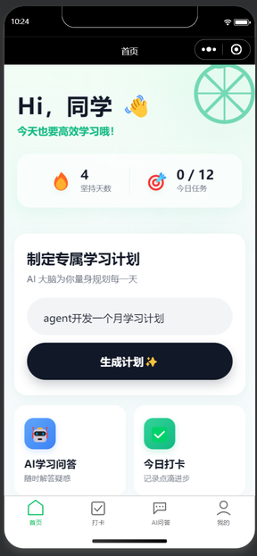
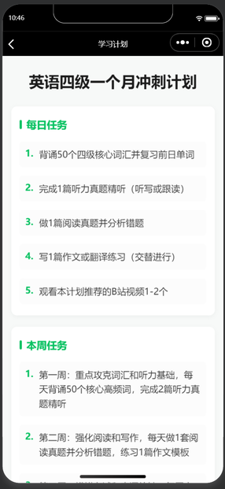
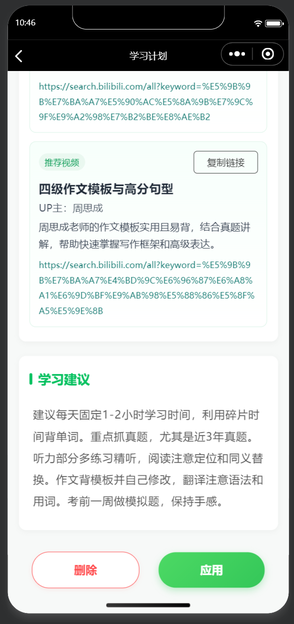
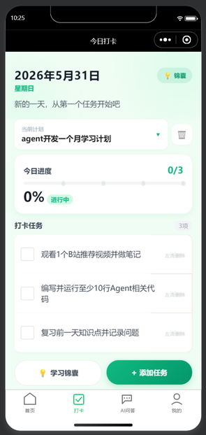
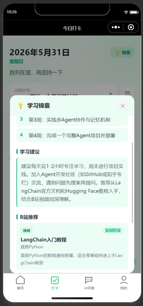
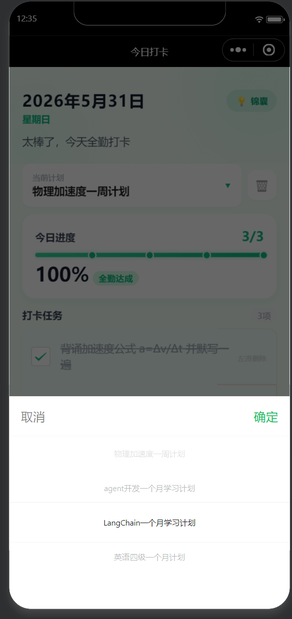
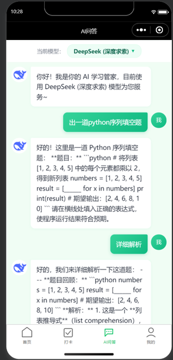
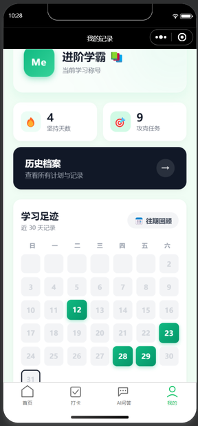

# AI自习室学习管家

微信小程序，用 AI 辅助制定学习计划、每日打卡和学习问答。

## 功能

- **学习计划**：输入目标，AI 自动生成学习计划和每周任务
- **每日打卡**：按计划完成每日任务并记录进度
- **AI 问答**：内置多模型支持，学习过程中随时提问
- **历史记录**：查看打卡和计划执行历史

## 技术栈

- 微信小程序原生开发
- 微信云开发（云函数）
- AI 模型：DeepSeek / 智谱 GLM / 腾讯混元

## 运行

1. 克隆仓库
2. 用微信开发者工具打开项目
3. 在 `cloudfunctions/*/aiProvider.js` 中填入你自己的 API Key（制定计划只需填入getPlan中的deep seek API Key即可）
4. 上传并部署云函数

## 目录结构

```
├── cloudfunctions/    # 云函数（AI对话、计划生成、登录、同步等）
├── pages/             # 小程序页面
├── utils/             # 工具模块
├── images/            # 图片资源
├── app.js / app.json  # 小程序入口
└── project.config.json # 项目配置（含 AppID）
```
## 展示图片
  首页（计划生成主页面）
|||
| 首页主界面 | 学习锦囊 | 学习锦囊 |
在输入框内输入学习目标和周期（例如：英语四级一个月冲刺）
稍等片刻即会出现对应计划（包含：每周，每日，学习建议，b站视频链接）

打卡页（每日学习任务记录）
|  |  | 
| 每日打卡 | 学习锦囊 | 学习任务切换|
勾选任务可以完成任务打卡，支持自定义新建or删除计划，支持多项学习任务打卡（上方滚轮切换）

AI问答页（解决学习难题）

全能AI助手，可提问、练习、规划等

我的页面

查看打卡记录，学习记录以及学习等级提升，增加成就感
## 许可

MIT
